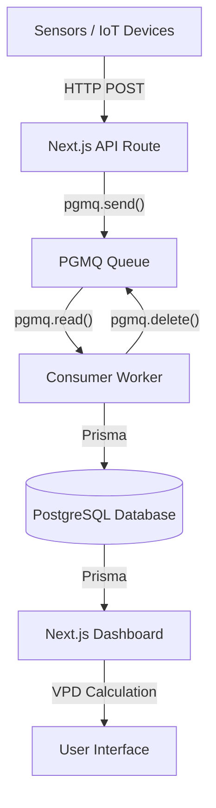

# Cultivators Ledger 

A local-first cultivation analytics suite for growers who want precision data and full control over their environment.

## Overview

This is a **local-first** telemetry engine that runs entirely on your own hardware. The core platform is open-source and self-hosted—your data stays on your network unless you choose otherwise.

Key features:

- **Real-time VPD tracking** – Know exactly when your plants are breathing optimally
- **Crop steering analytics** – Track dry-back slopes to dial in irrigation
- **Manual data entry** – Use it as a digital journal, even without sensors
- **Multi-room / multi-zone support** – Monitor different environments separately
- **CSV import** – Bring your existing spreadsheets into the system
- **DIY hardware support** – Connect your own sensors via Home Assistant

## Philosophy

This software is built on a few core principles:

- **Open core** – The local-first engine is open-source (AGPLv3) and free to use
- **Commercial use** – Facilities operating at scale pay a fair license fee (see [COMMERCIAL-LICENSE.md](COMMERCIAL-LICENSE.md))
- **Data sovereignty** – Your data stays local; optional cloud sync is an add-on convenience, not a requirement

## Architecture



## Quick Start

Prerequisites

 - Docker and Docker Compose
 - Python 3.10+ (for sensor scripts)
 - PostgreSQL 15+ (handled by Docker)

1. Clone the repository
   
```bash
git clone https://github.com/growerzer0/cultivatorsledger.git
cd cultivatorsledger
```

Get Involved

- Report bugs – Open an issue with the bug label
- Suggest features – Open an issue with the enhancement label
- Submit code – Fork the repo and open a pull request
- Ask questions – Start a discussion (if enabled)

## ⭐ Support

If this project is useful to you, consider starring the repo to help others find it.

